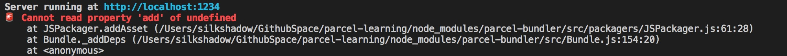

# 资源处理

## CSS

### 1. sass/less/stylus

- sass 编译需要 node-sass 模块 `yarn add node-sass --save-dev`
- less 编译需要 less 模块 `yarn add less --save-dev`
- stylus 编译需要 stylus 模块 `yarn add stylus --save-dev`

### 2. postcss

在应用中安装插件:
`yarn add postcss-modules autoprefixer --save-dev`
然后新建一个 .postcssrc 文件：

``` bash
{
  "modules": true,
  "plugins": {
    "autoprefixer": {
      "grid": true
    }
  }
}
```

### 3. 踩坑

[安装`parcel-plugin-vue`后，css加载静态资源会报错：](https://github.com/parcel-bundler/parcel/issues/659)



- 解决方案1：

打开 `\node_modules\parcel-bundler\src\packagers\JSPackager.js` 56 行可以看到:

``` js
  this.bundleLoaders.add(mod.type);
```

修改为：

``` js
  if(!this.bundleLoaders){
      this.bundleLoaders = new Set();
  }
  this.bundleLoaders.add(mod.type);
```

- 解决方案2：

引入所有静态资源，再引入css:

``` js
// importing static assets
import './images/**/**';

// importing styles
import './scss/style.scss';
```

## JS

### 1. Babel

安装插件：
`yarn add babel-preset-env --save-dev`

然后创建一个 .babelrc 文件：

```bash
{
  "presets": ["env"]
}

# 编译react
{
  "presets": ["env","react"]
}
```

### 2. TypeScript

全局安装`typescript`:
`npm install typescript -g`

编译 TypeScript 是一个开箱即用的功能，不需要任何条件配置

``` html
<!-- index.html -->
<html>
<body>
  <script src="./index.ts"></script>
</body>
</html>
```

``` ts
// index.ts
import message from "./message";
console.log(message);
// message.ts
export default "Hello, world";
```