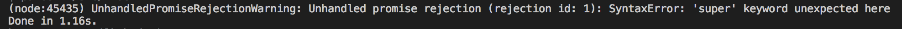

# [Parcel](https://parceljs.org/) 快速入门
> 极速零配置Web应用打包工具

## Parcel有什么好处
- 极速打包
- 将你所有的资源打包
- 自动转换
- 零配置代码分拆
- 热模块替换
- 友好的错误日志

什么时候使用 Parcel ， Webpack 或 Rollup 呢？
- Parcel：中小型项目（代码行小于 15k）。
- Webpack：大型以及企业级项目。
- Rollup：用于 NPM 包。

## 安装

```
  Yarn:
  yarn global add parcel-bundler
  npm:
  npm install -g parcel-bundler

  使用以下命令在你的项目目录中新建一个 package.json 文件：
  yarn init -y
  npm init -y
```

> tips:
node version在8+ 才支持，否则将会出现以下报错


```
Yarn version:
  1.3.2

Node version:
  8.9.3

Platform:
  darwin x64
```

## 快速开始

```
  yarn init -y
  parcel-bundler --save-dev
```

创建 index.html & index.js

``` html
<!-- index.html -->
<html>
<body>
  <script src="./index.js"></script>
</body>
</html>
```

``` js
// index.js
document.write('hello parcel')
```

在项目目录下执行 `parcel index.html`
现在在你的浏览器中打开[http://localhost:1234/](http://localhost:1234/)

1. Parcel 内置了一个当你改变文件时能够自动重新构建应用的开发服务器，而且为了实现快速开发，该开发服务器支持热模块替换。
2. 可以使用 `-p <port number>` 选项更改默认端口。
3. 如果你有自己的服务器，你可以以 watch 模式运行 Parcel。(`parcel watch index.html`)这样在文件更改时，依然会自动重建应用，并支持热更新，但不会启动 web 服务器。
4. 热模块重载(HMR)有两种已知方法： `module.hot.accept` 和 `module.hot.dispose`。你可以调用 module.hot.accept 并赋予一个回调函数，该函数会在模块或其他依赖项被更新时执行。当该模块即将被替换时，module.hot.dispose 回调函数会被调用。
  ``` js
    if (module.hot) {
    module.hot.dispose(function () {
      // 模块即将被替换时
    });

      module.hot.accept(function () {
        // 模块或其依赖项之一刚刚更新时
      });
    }
  ```

## 打包生产

执行 `parcel build index.js`，这将关闭监听模式和热模块替换，所以它只会编译一次。

### Options

| 设置项 | options  |
|---|---|
| 设置输出目录 | -d   |
| 设置要提供服务的公共 URL | --public-url |
| 禁用压缩 | --no-minify |
| 禁用文件系统缓存 | --no-cache |